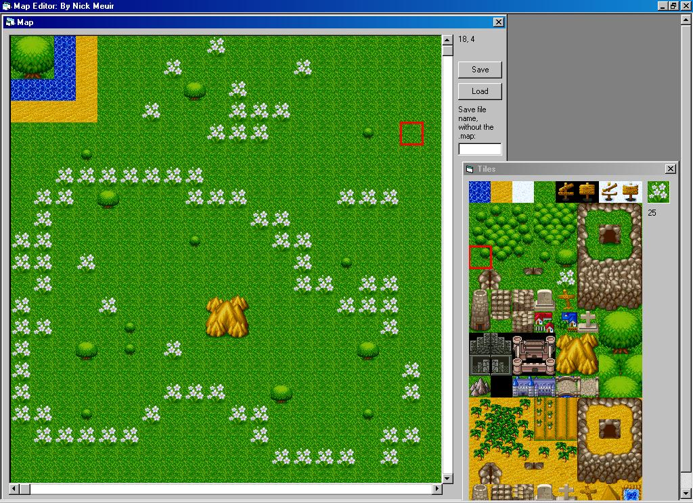



## \[Simple\] Map Editor

### Description

This loads/edits/saves .map files for use in tile games. Comes with some sample maps. Also comes with a great tileset.

I hope you all enjoy it.

Feedback please~!

And... a thanks to Electroman for helping me.
 
### More Info
 

             |
---                |---
**Submitted On**   |2003-07-04 08:03:12
**By**             |[Nick Meuir](https://github.com/Planet-Source-Code/PSCIndex/blob/master/ByAuthor/nick-meuir.md)
**Level**          |Intermediate
**User Rating**    |4.7 (61 globes from 13 users)
**Compatibility**  |VB 6\.0
**Category**       |[Games](https://github.com/Planet-Source-Code/PSCIndex/blob/master/ByCategory/games__1-38.md)
**World**          |[Visual Basic](https://github.com/Planet-Source-Code/PSCIndex/blob/master/ByWorld/visual-basic.md)
**Archive File**   |[Map\_Editor160954742003\.zip](https://github.com/Planet-Source-Code/nick-meuir-simple-map-editor__1-46635/archive/master.zip)

